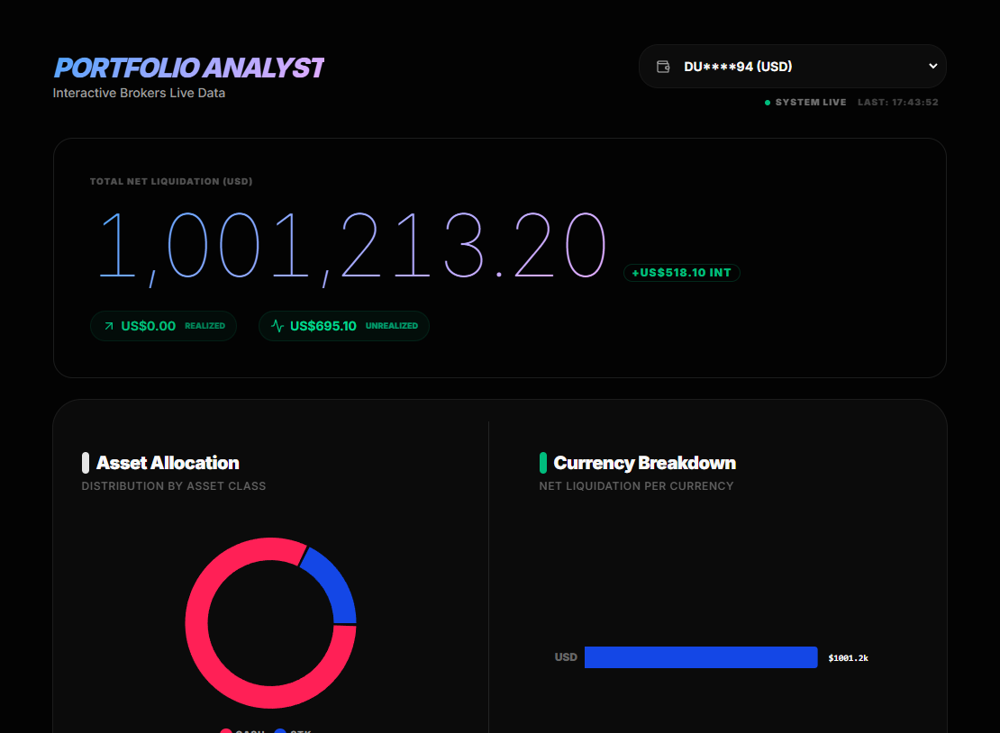

# Ibkr dashboard

An IBKR dashboard that displays assets and positions in real time with read-only access



[](https://deploy.workers.cloudflare.com/?url=https://github.com/invmy/ibkr-web-Dashboard)

After deployment is complete, enter the `secret variable` in the control panel

## Oauth1.0a

You must enable OAuth 1.0a; no review is required. It will be available the next day.

https://github.com/Voyz/ibind/wiki/OAuth-1.0a

| IBKR API Key/Secret     | Purpose                                             |
| ----------------------- | --------------------------------------------------- |
| OAUTH_CONSUMER_KEY      | OAuth Consumer Key                                  |
| IBKR_KEY                | Access Token                                        |
| IBKR_KEY_TOKEN          | Access Token Secret                                 |
| IBKR_DHPARAM            | Diffie-Hellman pem file content. Base64 Encoded     |
| IBKR_PRIVATE_ENCRYPTION | Private Encryption pem file content. Base64 Encoded |
| IBKR_PRIVATE_SIGNATURE  | Private Signature pem file content. Base64 Encoded  |

### base64 command

#### Linux & macOS

```bash
openssl base64 -A -in yourfile.txt
```

#### Windows

base64 encode to clip

```
[Convert]::ToBase64String([IO.File]::ReadAllBytes("yourfile.txt")).Replace("`r`n", "").Replace("`n", "") | clip
```

## Add secrets

enter the `secret variable` in the control panel

## Commands

All commands are run from the root of the project, from a terminal:

| Command                   | Action                                           |
| :------------------------ | :----------------------------------------------- |
| `bun install`             | Installs dependencies                            |
| `bun run dev`             | Starts local dev server at `localhost:4321`      |
| `bun run build`           | Build your production site to `./dist/`          |
| `bun run preview`         | Preview your build locally, before deploying     |
| `bun run astro ...`       | Run CLI commands like `astro add`, `astro check` |
| `bun run astro -- --help` | Get help using the Astro CLI                     |
| `bun wrangler deploy`     | Deploy to Cloudflare Workers                     |

## local development

create .env

```env
OAUTH_CONSUMER_KEY=
IBKR_KEY=
IBKR_KEY_TOKEN=
IBKR_DHPARAM=
IBKR_PRIVATE_ENCRYPTION=
IBKR_PRIVATE_SIGNATURE=
```
